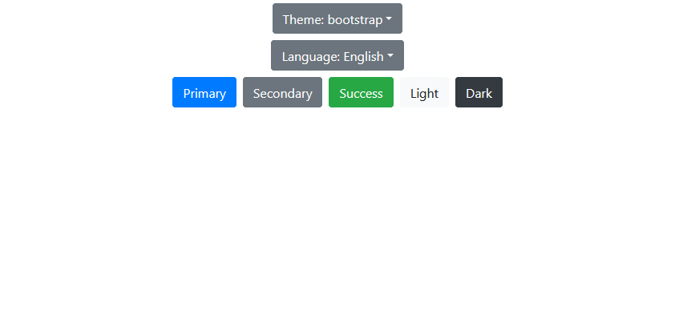

A simple React application showcasing multiple themes and translations (using localstorage)

Full tutorial/explanation can be found here: https://medium.com/@machinellama/simple-translation-and-theme-selection-with-react-localstorage-and-bootstrap-326d421ffcbe

* This project was bootstrapped with [Create React App](https://github.com/facebook/create-react-app).
